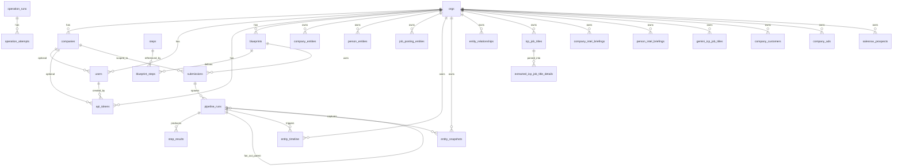

# Database Schema Audit — data-engine-x

**Generated:** 2026-03-10
**Source:** Migrations `001`–`020`, application service code

---

## 0. Schema Organization

All tables live in the **`public`** schema. There are no separate Postgres schemas (`raw`, `extracted`, `core`, etc.). Stage-of-processing is encoded in table naming conventions rather than schema separation:

| Naming Convention | Stage | Examples |
|---|---|---|
| `*_entities` | Canonical / golden record | `company_entities`, `person_entities`, `job_posting_entities` |
| `icp_job_titles`, `company_intel_briefings`, `person_intel_briefings` | Raw provider output | Stores `raw_parallel_output JSONB` verbatim |
| `extracted_icp_job_title_details` | Extracted / intermediate | Structured rows parsed from raw JSONB |
| `company_customers`, `company_ads`, `salesnav_prospects` | Dedicated fact tables | Denormalized rows per discovered item |
| `operation_runs`, `operation_attempts` | Execution audit | Provider-level call logs |
| `entity_timeline`, `entity_snapshots` | Entity audit / history | Change lineage and point-in-time snapshots |
| `orgs`, `companies`, `users`, `api_tokens`, `super_admins` | Tenancy / auth | Multi-tenant root |
| `steps`, `blueprints`, `blueprint_steps` | Configuration | Pipeline definition |
| `submissions`, `pipeline_runs`, `step_results` | Orchestration | Pipeline execution state |

---

## 1. Table Inventory

### 1.1 Tenancy & Auth

#### `orgs`
| Column | Type | Nullable | Default | Notes |
|---|---|---|---|---|
| `id` | `UUID` | NOT NULL | `uuid_generate_v4()` | PK |
| `name` | `TEXT` | NOT NULL | — | |
| `slug` | `TEXT` | NOT NULL | — | UNIQUE |
| `created_at` | `TIMESTAMPTZ` | NOT NULL | `NOW()` | |
| `updated_at` | `TIMESTAMPTZ` | NOT NULL | `NOW()` | auto-trigger |

**Classification:** Configuration / tenant root

#### `companies`
| Column | Type | Nullable | Default | Notes |
|---|---|---|---|---|
| `id` | `UUID` | NOT NULL | `uuid_generate_v4()` | PK |
| `org_id` | `UUID` | NOT NULL | — | FK → `orgs(id)` CASCADE |
| `name` | `TEXT` | NOT NULL | — | |
| `external_ref` | `TEXT` | NULL | — | |
| `domain` | `TEXT` | NULL | — | Added in 008 |
| `created_at` | `TIMESTAMPTZ` | NOT NULL | `NOW()` | |
| `updated_at` | `TIMESTAMPTZ` | NOT NULL | `NOW()` | auto-trigger |

Unique constraints: `(org_id, name)`, `(id, org_id)`. Partial unique index on `(org_id, external_ref)` WHERE NOT NULL.

**Classification:** Configuration / tenant child. Represents a client company (the tenant's customer), not a data-enrichment target company.

#### `users`
| Column | Type | Nullable | Default | Notes |
|---|---|---|---|---|
| `id` | `UUID` | NOT NULL | `uuid_generate_v4()` | PK |
| `org_id` | `UUID` | NOT NULL | — | FK → `orgs(id)` CASCADE |
| `company_id` | `UUID` | NULL | — | FK → `companies(id)` RESTRICT |
| `email` | `CITEXT` | NOT NULL | — | UNIQUE |
| `full_name` | `TEXT` | NULL | — | |
| `role` | `user_role` | NOT NULL | — | ENUM: org_admin, company_admin, member |
| `is_active` | `BOOLEAN` | NOT NULL | `TRUE` | |
| `password_hash` | `TEXT` | NULL | — | Added in 002 |
| `created_at` | `TIMESTAMPTZ` | NOT NULL | `NOW()` | |
| `updated_at` | `TIMESTAMPTZ` | NOT NULL | `NOW()` | auto-trigger |

**Classification:** Configuration / auth

#### `api_tokens`
| Column | Type | Nullable | Default | Notes |
|---|---|---|---|---|
| `id` | `UUID` | NOT NULL | `uuid_generate_v4()` | PK |
| `org_id` | `UUID` | NOT NULL | — | FK → `orgs(id)` CASCADE |
| `company_id` | `UUID` | NULL | — | FK → `companies(id)` RESTRICT |
| `name` | `TEXT` | NOT NULL | — | |
| `token_hash` | `TEXT` | NOT NULL | — | UNIQUE |
| `role` | `user_role` | NOT NULL | — | |
| `created_by_user_id` | `UUID` | NULL | — | FK → `users(id)` SET NULL |
| `user_id` | `UUID` | NULL | — | FK → `users(id)` CASCADE. Added in 003 |
| `last_used_at` | `TIMESTAMPTZ` | NULL | — | |
| `expires_at` | `TIMESTAMPTZ` | NULL | — | |
| `revoked_at` | `TIMESTAMPTZ` | NULL | — | |
| `created_at` | `TIMESTAMPTZ` | NOT NULL | `NOW()` | |
| `updated_at` | `TIMESTAMPTZ` | NOT NULL | `NOW()` | auto-trigger |

**Classification:** Configuration / auth

#### `super_admins`
| Column | Type | Nullable | Default | Notes |
|---|---|---|---|---|
| `id` | `UUID` | NOT NULL | `uuid_generate_v4()` | PK |
| `email` | `CITEXT` | NOT NULL | — | UNIQUE |
| `password_hash` | `TEXT` | NOT NULL | — | |
| `is_active` | `BOOLEAN` | NOT NULL | `TRUE` | |
| `created_at` | `TIMESTAMPTZ` | NOT NULL | `NOW()` | |
| `updated_at` | `TIMESTAMPTZ` | NOT NULL | `NOW()` | auto-trigger |

**Classification:** Configuration / platform auth. Not tenant-scoped.

---

### 1.2 Pipeline Configuration

#### `steps`
| Column | Type | Nullable | Default | Notes |
|---|---|---|---|---|
| `id` | `UUID` | NOT NULL | `uuid_generate_v4()` | PK |
| `slug` | `TEXT` | NOT NULL | — | UNIQUE |
| `task_id` | `TEXT` | NOT NULL | — | UNIQUE |
| `name` | `TEXT` | NOT NULL | — | |
| `description` | `TEXT` | NULL | — | |
| `step_type` | `step_type` | NOT NULL | — | ENUM: clean, enrich, analyze, extract, transform |
| `default_config` | `JSONB` | NOT NULL | `'{}'` | |
| `input_schema` | `JSONB` | NULL | — | |
| `output_schema` | `JSONB` | NULL | — | |
| `is_active` | `BOOLEAN` | NOT NULL | `TRUE` | |
| `url` | `TEXT` | NOT NULL | `'https://example.invalid/step-endpoint'` | Added in 004. Legacy executor config |
| `method` | `TEXT` | NOT NULL | `'POST'` | Added in 004 |
| `auth_type` | `TEXT` | NULL | — | Added in 004 |
| `auth_config` | `JSONB` | NOT NULL | `'{}'` | Added in 004 |
| `payload_template` | `JSONB` | NULL | — | Added in 004 |
| `response_mapping` | `JSONB` | NULL | — | Added in 004 |
| `timeout_ms` | `INT` | NULL | `30000` | Added in 004 |
| `retry_config` | `JSONB` | NOT NULL | `'{"max_attempts":3,"backoff_factor":2}'` | Added in 004 |
| `created_at` | `TIMESTAMPTZ` | NOT NULL | `NOW()` | |
| `updated_at` | `TIMESTAMPTZ` | NOT NULL | `NOW()` | auto-trigger |

**Classification:** Configuration / global step registry. Not tenant-scoped.

#### `blueprints`
| Column | Type | Nullable | Default | Notes |
|---|---|---|---|---|
| `id` | `UUID` | NOT NULL | `uuid_generate_v4()` | PK |
| `org_id` | `UUID` | NOT NULL | — | FK → `orgs(id)` CASCADE |
| `name` | `TEXT` | NOT NULL | — | |
| `description` | `TEXT` | NULL | — | |
| `is_active` | `BOOLEAN` | NOT NULL | `TRUE` | |
| `created_by_user_id` | `UUID` | NULL | — | FK → `users(id)` SET NULL |
| `created_at` | `TIMESTAMPTZ` | NOT NULL | `NOW()` | |
| `updated_at` | `TIMESTAMPTZ` | NOT NULL | `NOW()` | auto-trigger |

Unique constraints: `(org_id, name)`, `(id, org_id)`.

**Classification:** Configuration / org-scoped blueprint definitions

#### `blueprint_steps`
| Column | Type | Nullable | Default | Notes |
|---|---|---|---|---|
| `id` | `UUID` | NOT NULL | `uuid_generate_v4()` | PK |
| `blueprint_id` | `UUID` | NOT NULL | — | FK → `blueprints(id)` CASCADE |
| `step_id` | `UUID` | NULL | — | FK → `steps(id)` RESTRICT. Nullable since 006 |
| `position` | `INT` | NOT NULL | — | CHECK > 0. UNIQUE per blueprint |
| `config` | `JSONB` | NOT NULL | `'{}'` | |
| `is_enabled` | `BOOLEAN` | NOT NULL | `TRUE` | |
| `operation_id` | `TEXT` | NULL | — | Added in 006. Operation-native steps |
| `step_config` | `JSONB` | NULL | — | Added in 006 |
| `fan_out` | `BOOLEAN` | NOT NULL | `FALSE` | Added in 010 |
| `created_at` | `TIMESTAMPTZ` | NOT NULL | `NOW()` | |
| `updated_at` | `TIMESTAMPTZ` | NOT NULL | `NOW()` | auto-trigger |

**Classification:** Junction / configuration. Links blueprints to steps with position and config overrides.

---

### 1.3 Pipeline Orchestration

#### `submissions`
| Column | Type | Nullable | Default | Notes |
|---|---|---|---|---|
| `id` | `UUID` | NOT NULL | `uuid_generate_v4()` | PK |
| `org_id` | `UUID` | NOT NULL | — | FK → `orgs(id)` CASCADE |
| `company_id` | `UUID` | NOT NULL | — | FK → `companies(id)` RESTRICT |
| `blueprint_id` | `UUID` | NOT NULL | — | FK → `blueprints(id)` RESTRICT |
| `submitted_by_user_id` | `UUID` | NULL | — | FK → `users(id)` SET NULL |
| `source` | `TEXT` | NULL | — | |
| `input_payload` | `JSONB` | NOT NULL | — | |
| `status` | `submission_status` | NOT NULL | `'received'` | ENUM: received, validated, queued, running, completed, failed, canceled |
| `metadata` | `JSONB` | NOT NULL | `'{}'` | |
| `created_at` | `TIMESTAMPTZ` | NOT NULL | `NOW()` | |
| `updated_at` | `TIMESTAMPTZ` | NOT NULL | `NOW()` | auto-trigger |

**Classification:** Event / fact table. One row per batch submission request.

#### `pipeline_runs`
| Column | Type | Nullable | Default | Notes |
|---|---|---|---|---|
| `id` | `UUID` | NOT NULL | `uuid_generate_v4()` | PK |
| `org_id` | `UUID` | NOT NULL | — | FK → `orgs(id)` CASCADE |
| `company_id` | `UUID` | NOT NULL | — | FK → `companies(id)` RESTRICT |
| `submission_id` | `UUID` | NOT NULL | — | FK → `submissions(id)` CASCADE |
| `blueprint_id` | `UUID` | NOT NULL | — | FK → `blueprints(id)` RESTRICT |
| `trigger_run_id` | `TEXT` | NULL | — | UNIQUE. Trigger.dev run ID |
| `blueprint_snapshot` | `JSONB` | NOT NULL | `'{}'` | Point-in-time blueprint config |
| `blueprint_version` | `INT` | NOT NULL | `1` | CHECK > 0 |
| `status` | `run_status` | NOT NULL | `'queued'` | ENUM: queued, running, succeeded, failed, canceled |
| `attempt` | `INT` | NOT NULL | `1` | CHECK > 0 |
| `started_at` | `TIMESTAMPTZ` | NULL | — | |
| `finished_at` | `TIMESTAMPTZ` | NULL | — | |
| `error_message` | `TEXT` | NULL | — | |
| `error_details` | `JSONB` | NULL | — | |
| `parent_pipeline_run_id` | `UUID` | NULL | — | FK → `pipeline_runs(id)` SET NULL. Added in 010 |
| `created_at` | `TIMESTAMPTZ` | NOT NULL | `NOW()` | |
| `updated_at` | `TIMESTAMPTZ` | NOT NULL | `NOW()` | auto-trigger |

**Classification:** Event / fact table. One row per pipeline execution (including fan-out children).

#### `step_results`
| Column | Type | Nullable | Default | Notes |
|---|---|---|---|---|
| `id` | `UUID` | NOT NULL | `uuid_generate_v4()` | PK |
| `org_id` | `UUID` | NOT NULL | — | FK → `orgs(id)` CASCADE |
| `company_id` | `UUID` | NOT NULL | — | FK → `companies(id)` RESTRICT |
| `pipeline_run_id` | `UUID` | NOT NULL | — | FK → `pipeline_runs(id)` CASCADE |
| `submission_id` | `UUID` | NOT NULL | — | FK → `submissions(id)` CASCADE |
| `step_id` | `UUID` | NULL | — | FK → `steps(id)` RESTRICT. Nullable since 006 |
| `blueprint_step_id` | `UUID` | NULL | — | FK → `blueprint_steps(id)` SET NULL |
| `step_position` | `INT` | NOT NULL | — | CHECK > 0 |
| `task_run_id` | `TEXT` | NULL | — | |
| `status` | `step_status` | NOT NULL | `'queued'` | ENUM: queued, running, succeeded, failed, skipped, retrying |
| `input_payload` | `JSONB` | NULL | — | |
| `output_payload` | `JSONB` | NULL | — | |
| `error_message` | `TEXT` | NULL | — | |
| `error_details` | `JSONB` | NULL | — | |
| `started_at` | `TIMESTAMPTZ` | NULL | — | |
| `finished_at` | `TIMESTAMPTZ` | NULL | — | |
| `duration_ms` | `INT` | NULL | — | CHECK >= 0 |
| `attempt` | `INT` | NOT NULL | `1` | CHECK > 0 |
| `created_at` | `TIMESTAMPTZ` | NOT NULL | `NOW()` | |
| `updated_at` | `TIMESTAMPTZ` | NOT NULL | `NOW()` | auto-trigger |

Unique constraint: `(pipeline_run_id, step_position, attempt)`.

**Classification:** Event / fact table. One row per step execution within a pipeline run.

---

### 1.4 Operation Execution Audit

#### `operation_runs`
| Column | Type | Nullable | Default | Notes |
|---|---|---|---|---|
| `run_id` | `UUID` | NOT NULL | — | PK. Caller-generated |
| `org_id` | `UUID` | NOT NULL | — | FK → `orgs(id)` CASCADE |
| `company_id` | `UUID` | NULL | — | FK → `companies(id)` RESTRICT |
| `user_id` | `UUID` | NULL | — | FK → `users(id)` SET NULL |
| `role` | `TEXT` | NOT NULL | — | |
| `auth_method` | `TEXT` | NOT NULL | — | |
| `operation_id` | `TEXT` | NOT NULL | — | |
| `entity_type` | `TEXT` | NOT NULL | — | CHECK IN ('company', 'person', 'job') |
| `status` | `TEXT` | NOT NULL | — | CHECK IN ('found', 'not_found', 'failed', 'verified') |
| `missing_inputs` | `JSONB` | NOT NULL | `'[]'` | |
| `input_payload` | `JSONB` | NOT NULL | — | |
| `output_payload` | `JSONB` | NULL | — | |
| `created_at` | `TIMESTAMPTZ` | NOT NULL | `NOW()` | |
| `updated_at` | `TIMESTAMPTZ` | NOT NULL | `NOW()` | auto-trigger |

**Classification:** Event / fact table. One row per `/api/v1/execute` call.

#### `operation_attempts`
| Column | Type | Nullable | Default | Notes |
|---|---|---|---|---|
| `id` | `UUID` | NOT NULL | `uuid_generate_v4()` | PK |
| `run_id` | `UUID` | NOT NULL | — | FK → `operation_runs(run_id)` CASCADE |
| `provider` | `TEXT` | NOT NULL | — | |
| `action` | `TEXT` | NOT NULL | — | |
| `status` | `TEXT` | NOT NULL | — | CHECK IN ('found', 'not_found', 'failed', 'verified', 'skipped') |
| `skip_reason` | `TEXT` | NULL | — | |
| `http_status` | `INT` | NULL | — | |
| `provider_status` | `TEXT` | NULL | — | |
| `duration_ms` | `INT` | NULL | — | CHECK >= 0 |
| `raw_response` | `JSONB` | NULL | — | Full provider HTTP response |
| `created_at` | `TIMESTAMPTZ` | NOT NULL | `NOW()` | |

**Classification:** Event / fact table. One row per provider-level attempt within an operation run.

---

### 1.5 Entity State (Canonical)

#### `company_entities`
| Column | Type | Nullable | Default | Notes |
|---|---|---|---|---|
| `org_id` | `UUID` | NOT NULL | — | FK → `orgs(id)` CASCADE. Part of composite PK |
| `company_id` | `UUID` | NULL | — | FK → `companies(id)` SET NULL |
| `entity_id` | `UUID` | NOT NULL | — | Part of composite PK |
| `canonical_domain` | `TEXT` | NULL | — | |
| `canonical_name` | `TEXT` | NULL | — | |
| `linkedin_url` | `TEXT` | NULL | — | |
| `industry` | `TEXT` | NULL | — | |
| `employee_count` | `INT` | NULL | — | |
| `employee_range` | `TEXT` | NULL | — | |
| `revenue_band` | `TEXT` | NULL | — | |
| `hq_country` | `TEXT` | NULL | — | |
| `description` | `TEXT` | NULL | — | |
| `enrichment_confidence` | `NUMERIC` | NULL | — | |
| `last_enriched_at` | `TIMESTAMPTZ` | NULL | — | |
| `last_operation_id` | `TEXT` | NULL | — | |
| `last_run_id` | `UUID` | NULL | — | FK → `pipeline_runs(id)` SET NULL |
| `source_providers` | `TEXT[]` | NULL | — | Array of provider names |
| `record_version` | `BIGINT` | NOT NULL | `1` | CHECK > 0. Optimistic concurrency |
| `canonical_payload` | `JSONB` | NULL | — | Merged canonical fields |
| `company_linkedin_id` | `TEXT` | NULL | — | Added in 018 |
| `icp_criterion` | `TEXT` | NULL | — | Added in 018 |
| `salesnav_url` | `TEXT` | NULL | — | Added in 018 |
| `icp_fit_verdict` | `TEXT` | NULL | — | Added in 018 |
| `icp_fit_reasoning` | `TEXT` | NULL | — | Added in 018 |
| `created_at` | `TIMESTAMPTZ` | NOT NULL | `NOW()` | |
| `updated_at` | `TIMESTAMPTZ` | NOT NULL | `NOW()` | auto-trigger |

PK: `(org_id, entity_id)`.

**Classification:** Canonical / core entity table. Golden record for companies.

#### `person_entities`
| Column | Type | Nullable | Default | Notes |
|---|---|---|---|---|
| `org_id` | `UUID` | NOT NULL | — | FK → `orgs(id)` CASCADE. Part of composite PK |
| `company_id` | `UUID` | NULL | — | FK → `companies(id)` SET NULL |
| `entity_id` | `UUID` | NOT NULL | — | Part of composite PK |
| `full_name` | `TEXT` | NULL | — | |
| `first_name` | `TEXT` | NULL | — | |
| `last_name` | `TEXT` | NULL | — | |
| `linkedin_url` | `TEXT` | NULL | — | |
| `title` | `TEXT` | NULL | — | |
| `seniority` | `TEXT` | NULL | — | |
| `department` | `TEXT` | NULL | — | |
| `work_email` | `TEXT` | NULL | — | |
| `email_status` | `TEXT` | NULL | — | |
| `phone_e164` | `TEXT` | NULL | — | |
| `contact_confidence` | `NUMERIC` | NULL | — | |
| `last_enriched_at` | `TIMESTAMPTZ` | NULL | — | |
| `last_operation_id` | `TEXT` | NULL | — | |
| `last_run_id` | `UUID` | NULL | — | FK → `pipeline_runs(id)` SET NULL |
| `record_version` | `BIGINT` | NOT NULL | `1` | CHECK > 0 |
| `canonical_payload` | `JSONB` | NULL | — | Merged canonical fields |
| `created_at` | `TIMESTAMPTZ` | NOT NULL | `NOW()` | |
| `updated_at` | `TIMESTAMPTZ` | NOT NULL | `NOW()` | auto-trigger |

PK: `(org_id, entity_id)`.

**Classification:** Canonical / core entity table. Golden record for persons.

#### `job_posting_entities`
| Column | Type | Nullable | Default | Notes |
|---|---|---|---|---|
| `org_id` | `UUID` | NOT NULL | — | FK → `orgs(id)` CASCADE. Part of composite PK |
| `company_id` | `UUID` | NULL | — | FK → `companies(id)` SET NULL |
| `entity_id` | `UUID` | NOT NULL | — | Part of composite PK |
| `theirstack_job_id` | `BIGINT` | NULL | — | |
| `job_url` | `TEXT` | NULL | — | |
| `job_title` | `TEXT` | NULL | — | |
| `normalized_title` | `TEXT` | NULL | — | |
| `company_name` | `TEXT` | NULL | — | |
| `company_domain` | `TEXT` | NULL | — | |
| `location` | `TEXT` | NULL | — | |
| `short_location` | `TEXT` | NULL | — | |
| `state_code` | `TEXT` | NULL | — | |
| `country_code` | `TEXT` | NULL | — | |
| `remote` | `BOOLEAN` | NULL | — | |
| `hybrid` | `BOOLEAN` | NULL | — | |
| `seniority` | `TEXT` | NULL | — | |
| `employment_statuses` | `TEXT[]` | NULL | — | |
| `date_posted` | `TEXT` | NULL | — | |
| `discovered_at` | `TEXT` | NULL | — | |
| `salary_string` | `TEXT` | NULL | — | |
| `min_annual_salary_usd` | `DOUBLE PRECISION` | NULL | — | |
| `max_annual_salary_usd` | `DOUBLE PRECISION` | NULL | — | |
| `description` | `TEXT` | NULL | — | |
| `technology_slugs` | `TEXT[]` | NULL | — | |
| `hiring_team` | `JSONB` | NULL | — | |
| `posting_status` | `TEXT` | NULL | `'active'` | CHECK IN ('active', 'likely_closed', 'confirmed_closed') |
| `enrichment_confidence` | `NUMERIC` | NULL | — | |
| `last_enriched_at` | `TIMESTAMPTZ` | NULL | — | |
| `last_operation_id` | `TEXT` | NULL | — | |
| `last_run_id` | `UUID` | NULL | — | FK → `pipeline_runs(id)` SET NULL |
| `source_providers` | `TEXT[]` | NULL | — | |
| `record_version` | `BIGINT` | NOT NULL | `1` | CHECK > 0 |
| `canonical_payload` | `JSONB` | NULL | — | |
| `created_at` | `TIMESTAMPTZ` | NOT NULL | `NOW()` | |
| `updated_at` | `TIMESTAMPTZ` | NOT NULL | `NOW()` | auto-trigger |

PK: `(org_id, entity_id)`.

**Classification:** Canonical / core entity table. Golden record for job postings.

---

### 1.6 Entity Audit & History

#### `entity_timeline`
| Column | Type | Nullable | Default | Notes |
|---|---|---|---|---|
| `id` | `UUID` | NOT NULL | `uuid_generate_v4()` | PK |
| `org_id` | `UUID` | NOT NULL | — | FK → `orgs(id)` CASCADE |
| `company_id` | `UUID` | NULL | — | FK → `companies(id)` SET NULL |
| `entity_type` | `TEXT` | NOT NULL | — | CHECK IN ('company', 'person', 'job') |
| `entity_id` | `UUID` | NOT NULL | — | **Implicit FK** → `*_entities.entity_id` (polymorphic) |
| `operation_id` | `TEXT` | NOT NULL | — | |
| `pipeline_run_id` | `UUID` | NULL | — | FK → `pipeline_runs(id)` SET NULL |
| `submission_id` | `UUID` | NULL | — | FK → `submissions(id)` SET NULL |
| `provider` | `TEXT` | NULL | — | |
| `status` | `TEXT` | NOT NULL | — | CHECK IN ('found', 'not_found', 'failed', 'skipped') |
| `fields_updated` | `TEXT[]` | NULL | — | |
| `summary` | `TEXT` | NULL | — | |
| `metadata` | `JSONB` | NULL | — | Contains event_type, step_result_id, provider_attempts |
| `created_at` | `TIMESTAMPTZ` | NOT NULL | `NOW()` | |

**Classification:** Event / fact table. Append-only operation lineage per entity.

#### `entity_snapshots`
| Column | Type | Nullable | Default | Notes |
|---|---|---|---|---|
| `id` | `UUID` | NOT NULL | `uuid_generate_v4()` | PK |
| `org_id` | `UUID` | NOT NULL | — | FK → `orgs(id)` CASCADE |
| `entity_type` | `TEXT` | NOT NULL | — | CHECK IN ('company', 'person', 'job') |
| `entity_id` | `UUID` | NOT NULL | — | **Implicit FK** → `*_entities.entity_id` (polymorphic) |
| `record_version` | `BIGINT` | NOT NULL | — | |
| `canonical_payload` | `JSONB` | NOT NULL | — | Point-in-time snapshot |
| `captured_at` | `TIMESTAMPTZ` | NOT NULL | `NOW()` | |
| `source_run_id` | `UUID` | NULL | — | FK → `pipeline_runs(id)` SET NULL |

Unique constraint: `(org_id, entity_type, entity_id, record_version)`.

**Classification:** Event / fact table. Immutable snapshots of entity state before each version bump.

---

### 1.7 Entity Relationships

#### `entity_relationships`
| Column | Type | Nullable | Default | Notes |
|---|---|---|---|---|
| `id` | `UUID` | NOT NULL | `gen_random_uuid()` | PK |
| `org_id` | `UUID` | NOT NULL | — | FK → `orgs(id)` CASCADE |
| `source_entity_type` | `TEXT` | NOT NULL | — | CHECK IN ('company', 'person') |
| `source_entity_id` | `UUID` | NULL | — | **Implicit FK** → `*_entities.entity_id` |
| `source_identifier` | `TEXT` | NOT NULL | — | Domain or LinkedIn URL |
| `relationship` | `TEXT` | NOT NULL | — | e.g. 'employs', 'works_at' |
| `target_entity_type` | `TEXT` | NOT NULL | — | CHECK IN ('company', 'person') |
| `target_entity_id` | `UUID` | NULL | — | **Implicit FK** → `*_entities.entity_id` |
| `target_identifier` | `TEXT` | NOT NULL | — | Domain or LinkedIn URL |
| `metadata` | `JSONB` | NULL | `'{}'` | |
| `source_submission_id` | `UUID` | NULL | — | FK → `submissions(id)` SET NULL |
| `source_pipeline_run_id` | `UUID` | NULL | — | FK → `pipeline_runs(id)` SET NULL |
| `source_operation_id` | `TEXT` | NULL | — | |
| `valid_as_of` | `TIMESTAMPTZ` | NOT NULL | `NOW()` | |
| `invalidated_at` | `TIMESTAMPTZ` | NULL | — | |
| `created_at` | `TIMESTAMPTZ` | NOT NULL | `NOW()` | |
| `updated_at` | `TIMESTAMPTZ` | NOT NULL | `NOW()` | auto-trigger |

Unique dedup: `(org_id, source_identifier, relationship, target_identifier)`.

**Classification:** Junction table with rich metadata. Typed, directional, temporally-scoped entity links.

---

### 1.8 Dedicated Research Output Tables

#### `icp_job_titles`
| Column | Type | Nullable | Default | Notes |
|---|---|---|---|---|
| `id` | `UUID` | NOT NULL | `gen_random_uuid()` | PK |
| `org_id` | `UUID` | NOT NULL | — | FK → `orgs(id)` CASCADE |
| `company_domain` | `TEXT` | NOT NULL | — | |
| `company_name` | `TEXT` | NULL | — | |
| `company_description` | `TEXT` | NULL | — | |
| `raw_parallel_output` | `JSONB` | NOT NULL | — | Raw Parallel.ai output blob |
| `extracted_titles` | `JSONB` | NULL | — | Parsed title list. Added in 017 |
| `parallel_run_id` | `TEXT` | NULL | — | |
| `processor` | `TEXT` | NULL | — | |
| `source_submission_id` | `UUID` | NULL | — | FK → `submissions(id)` SET NULL |
| `source_pipeline_run_id` | `UUID` | NULL | — | FK → `pipeline_runs(id)` SET NULL |
| `created_at` | `TIMESTAMPTZ` | NOT NULL | `NOW()` | |
| `updated_at` | `TIMESTAMPTZ` | NOT NULL | `NOW()` | auto-trigger |

Unique dedup: `(org_id, company_domain)`.

**Classification:** Raw / staging table. One row per company per org, storing verbatim Parallel.ai ICP research.

#### `extracted_icp_job_title_details`
| Column | Type | Nullable | Default | Notes |
|---|---|---|---|---|
| `id` | `UUID` | NOT NULL | `gen_random_uuid()` | PK |
| `org_id` | `UUID` | NOT NULL | — | FK → `orgs(id)` CASCADE |
| `company_domain` | `TEXT` | NOT NULL | — | |
| `company_name` | `TEXT` | NULL | — | |
| `title` | `TEXT` | NOT NULL | — | |
| `title_normalized` | `TEXT` | NOT NULL | — | `GENERATED ALWAYS AS (LOWER(TRIM(title))) STORED` |
| `buyer_role` | `TEXT` | NULL | — | e.g. champion, evaluator, decision_maker |
| `reasoning` | `TEXT` | NULL | — | |
| `source_icp_job_titles_id` | `UUID` | NULL | — | FK → `icp_job_titles(id)` SET NULL |
| `created_at` | `TIMESTAMPTZ` | NOT NULL | `NOW()` | |
| `updated_at` | `TIMESTAMPTZ` | NOT NULL | `NOW()` | auto-trigger |

Unique dedup: `(org_id, company_domain, title_normalized)`.

**Classification:** Extracted / intermediate table. Structured rows parsed from `icp_job_titles.raw_parallel_output`.

#### `company_intel_briefings`
| Column | Type | Nullable | Default | Notes |
|---|---|---|---|---|
| `id` | `UUID` | NOT NULL | `gen_random_uuid()` | PK |
| `org_id` | `UUID` | NOT NULL | — | FK → `orgs(id)` CASCADE |
| `company_domain` | `TEXT` | NOT NULL | — | |
| `company_name` | `TEXT` | NULL | — | |
| `client_company_name` | `TEXT` | NULL | — | The client company lens |
| `client_company_domain` | `TEXT` | NULL | — | |
| `client_company_description` | `TEXT` | NULL | — | |
| `raw_parallel_output` | `JSONB` | NOT NULL | — | Raw Parallel.ai output |
| `parallel_run_id` | `TEXT` | NULL | — | |
| `processor` | `TEXT` | NULL | — | |
| `source_submission_id` | `UUID` | NULL | — | FK → `submissions(id)` SET NULL |
| `source_pipeline_run_id` | `UUID` | NULL | — | FK → `pipeline_runs(id)` SET NULL |
| `created_at` | `TIMESTAMPTZ` | NOT NULL | `NOW()` | |
| `updated_at` | `TIMESTAMPTZ` | NOT NULL | `NOW()` | auto-trigger |

Unique dedup: `(org_id, company_domain, client_company_name)`.

**Classification:** Raw / staging table. Parallel.ai intel per target company, scoped to a client lens.

#### `person_intel_briefings`
| Column | Type | Nullable | Default | Notes |
|---|---|---|---|---|
| `id` | `UUID` | NOT NULL | `gen_random_uuid()` | PK |
| `org_id` | `UUID` | NOT NULL | — | FK → `orgs(id)` CASCADE |
| `person_linkedin_url` | `TEXT` | NULL | — | |
| `person_full_name` | `TEXT` | NOT NULL | — | |
| `person_current_company_name` | `TEXT` | NULL | — | |
| `person_current_company_domain` | `TEXT` | NULL | — | |
| `person_current_job_title` | `TEXT` | NULL | — | |
| `client_company_name` | `TEXT` | NULL | — | |
| `client_company_domain` | `TEXT` | NULL | — | |
| `client_company_description` | `TEXT` | NULL | — | |
| `customer_company_name` | `TEXT` | NULL | — | |
| `customer_company_domain` | `TEXT` | NULL | — | |
| `raw_parallel_output` | `JSONB` | NOT NULL | — | Raw Parallel.ai output |
| `parallel_run_id` | `TEXT` | NULL | — | |
| `processor` | `TEXT` | NULL | — | |
| `source_submission_id` | `UUID` | NULL | — | FK → `submissions(id)` SET NULL |
| `source_pipeline_run_id` | `UUID` | NULL | — | FK → `pipeline_runs(id)` SET NULL |
| `created_at` | `TIMESTAMPTZ` | NOT NULL | `NOW()` | |
| `updated_at` | `TIMESTAMPTZ` | NOT NULL | `NOW()` | auto-trigger |

Unique dedup: `(org_id, person_full_name, person_current_company_name, client_company_name)`.

**Classification:** Raw / staging table. Parallel.ai intel per person, scoped to a client + customer lens.

#### `gemini_icp_job_titles`
| Column | Type | Nullable | Default | Notes |
|---|---|---|---|---|
| `id` | `UUID` | NOT NULL | `gen_random_uuid()` | PK |
| `org_id` | `UUID` | NOT NULL | — | FK → `orgs(id)` CASCADE |
| `company_domain` | `TEXT` | NOT NULL | — | |
| `company_name` | `TEXT` | NULL | — | |
| `company_description` | `TEXT` | NULL | — | |
| `inferred_product` | `TEXT` | NULL | — | |
| `buyer_persona` | `TEXT` | NULL | — | |
| `titles` | `JSONB` | NULL | — | All titles |
| `champion_titles` | `JSONB` | NULL | — | |
| `evaluator_titles` | `JSONB` | NULL | — | |
| `decision_maker_titles` | `JSONB` | NULL | — | |
| `raw_response` | `JSONB` | NOT NULL | — | Full Gemini/HQ response |
| `source_submission_id` | `UUID` | NULL | — | FK → `submissions(id)` SET NULL |
| `source_pipeline_run_id` | `UUID` | NULL | — | FK → `pipeline_runs(id)` SET NULL |
| `created_at` | `TIMESTAMPTZ` | NOT NULL | `NOW()` | |
| `updated_at` | `TIMESTAMPTZ` | NOT NULL | `NOW()` | auto-trigger |

Unique dedup: `(org_id, company_domain)`.

**Classification:** Raw / staging table. Gemini-sourced ICP titles (separate from Parallel.ai-sourced `icp_job_titles`).

#### `company_customers`
| Column | Type | Nullable | Default | Notes |
|---|---|---|---|---|
| `id` | `UUID` | NOT NULL | `gen_random_uuid()` | PK |
| `org_id` | `UUID` | NOT NULL | — | FK → `orgs(id)` CASCADE |
| `company_entity_id` | `UUID` | NOT NULL | — | **Implicit FK** → `company_entities.entity_id` |
| `company_domain` | `TEXT` | NOT NULL | — | |
| `customer_name` | `TEXT` | NULL | — | |
| `customer_domain` | `TEXT` | NULL | — | |
| `customer_linkedin_url` | `TEXT` | NULL | — | |
| `customer_org_id` | `TEXT` | NULL | — | |
| `discovered_by_operation_id` | `TEXT` | NULL | — | |
| `source_submission_id` | `UUID` | NULL | — | FK → `submissions(id)` SET NULL |
| `source_pipeline_run_id` | `UUID` | NULL | — | FK → `pipeline_runs(id)` SET NULL |
| `created_at` | `TIMESTAMPTZ` | NOT NULL | `NOW()` | |
| `updated_at` | `TIMESTAMPTZ` | NOT NULL | `NOW()` | auto-trigger |

Unique dedup: `(org_id, company_domain, customer_domain)` WHERE `customer_domain IS NOT NULL`.

**Classification:** Fact table. Discovered customer relationships per company entity.

#### `company_ads`
| Column | Type | Nullable | Default | Notes |
|---|---|---|---|---|
| `id` | `UUID` | NOT NULL | `gen_random_uuid()` | PK |
| `org_id` | `UUID` | NOT NULL | — | FK → `orgs(id)` CASCADE |
| `company_domain` | `TEXT` | NOT NULL | — | |
| `company_entity_id` | `UUID` | NULL | — | **Implicit FK** → `company_entities.entity_id` |
| `platform` | `TEXT` | NOT NULL | — | LinkedIn, Meta, Google |
| `ad_id` | `TEXT` | NULL | — | Platform-specific ad identifier |
| `ad_type` | `TEXT` | NULL | — | |
| `ad_format` | `TEXT` | NULL | — | |
| `headline` | `TEXT` | NULL | — | |
| `body_text` | `TEXT` | NULL | — | |
| `cta_text` | `TEXT` | NULL | — | |
| `landing_page_url` | `TEXT` | NULL | — | |
| `media_url` | `TEXT` | NULL | — | |
| `media_type` | `TEXT` | NULL | — | |
| `advertiser_name` | `TEXT` | NULL | — | |
| `advertiser_url` | `TEXT` | NULL | — | |
| `start_date` | `TEXT` | NULL | — | |
| `end_date` | `TEXT` | NULL | — | |
| `is_active` | `BOOLEAN` | NULL | — | |
| `impressions_range` | `TEXT` | NULL | — | |
| `spend_range` | `TEXT` | NULL | — | |
| `country_code` | `TEXT` | NULL | — | |
| `raw_ad` | `JSONB` | NOT NULL | — | Full ad object from provider |
| `discovered_by_operation_id` | `TEXT` | NOT NULL | — | |
| `source_submission_id` | `UUID` | NULL | — | FK → `submissions(id)` SET NULL |
| `source_pipeline_run_id` | `UUID` | NULL | — | FK → `pipeline_runs(id)` SET NULL |
| `created_at` | `TIMESTAMPTZ` | NOT NULL | `NOW()` | |
| `updated_at` | `TIMESTAMPTZ` | NOT NULL | `NOW()` | auto-trigger |

Unique dedup: `(org_id, company_domain, platform, ad_id)` WHERE `ad_id IS NOT NULL`.

**Classification:** Fact table with raw archive. One row per ad per company.

#### `salesnav_prospects`
| Column | Type | Nullable | Default | Notes |
|---|---|---|---|---|
| `id` | `UUID` | NOT NULL | `gen_random_uuid()` | PK |
| `org_id` | `UUID` | NOT NULL | — | FK → `orgs(id)` CASCADE |
| `full_name` | `TEXT` | NULL | — | |
| `first_name` | `TEXT` | NULL | — | |
| `last_name` | `TEXT` | NULL | — | |
| `linkedin_url` | `TEXT` | NULL | — | |
| `profile_urn` | `TEXT` | NULL | — | |
| `geo_region` | `TEXT` | NULL | — | |
| `summary` | `TEXT` | NULL | — | |
| `current_title` | `TEXT` | NULL | — | |
| `current_company_name` | `TEXT` | NULL | — | |
| `current_company_id` | `TEXT` | NULL | — | |
| `current_company_industry` | `TEXT` | NULL | — | |
| `current_company_location` | `TEXT` | NULL | — | |
| `position_start_month` | `INT` | NULL | — | |
| `position_start_year` | `INT` | NULL | — | |
| `tenure_at_position_years` | `INT` | NULL | — | |
| `tenure_at_position_months` | `INT` | NULL | — | |
| `tenure_at_company_years` | `INT` | NULL | — | |
| `tenure_at_company_months` | `INT` | NULL | — | |
| `open_link` | `BOOLEAN` | NULL | — | |
| `source_company_domain` | `TEXT` | NOT NULL | — | |
| `source_company_name` | `TEXT` | NULL | — | |
| `source_salesnav_url` | `TEXT` | NULL | — | |
| `discovered_by_operation_id` | `TEXT` | NULL | — | |
| `source_submission_id` | `UUID` | NULL | — | FK → `submissions(id)` SET NULL |
| `source_pipeline_run_id` | `UUID` | NULL | — | FK → `pipeline_runs(id)` SET NULL |
| `raw_person` | `JSONB` | NOT NULL | — | Full prospect object from scraper |
| `created_at` | `TIMESTAMPTZ` | NOT NULL | `NOW()` | |
| `updated_at` | `TIMESTAMPTZ` | NOT NULL | `NOW()` | auto-trigger |

Unique dedup: `(org_id, source_company_domain, linkedin_url)` WHERE `linkedin_url IS NOT NULL`.

**Classification:** Fact / raw table. One row per prospect per source company.

---

## 2. Relationships

### 2.1 Enforced Foreign Keys

```
orgs
 ├── companies.org_id → orgs(id)
 ├── users.org_id → orgs(id)
 ├── api_tokens.org_id → orgs(id)
 ├── blueprints.org_id → orgs(id)
 ├── submissions.org_id → orgs(id)
 ├── pipeline_runs.org_id → orgs(id)
 ├── step_results.org_id → orgs(id)
 ├── operation_runs.org_id → orgs(id)
 ├── company_entities.org_id → orgs(id)
 ├── person_entities.org_id → orgs(id)
 ├── job_posting_entities.org_id → orgs(id)
 ├── entity_timeline.org_id → orgs(id)
 ├── entity_snapshots.org_id → orgs(id)
 ├── entity_relationships.org_id → orgs(id)
 ├── icp_job_titles.org_id → orgs(id)
 ├── extracted_icp_job_title_details.org_id → orgs(id)
 ├── company_intel_briefings.org_id → orgs(id)
 ├── person_intel_briefings.org_id → orgs(id)
 ├── gemini_icp_job_titles.org_id → orgs(id)
 ├── company_customers.org_id → orgs(id)
 ├── company_ads.org_id → orgs(id)
 └── salesnav_prospects.org_id → orgs(id)

companies
 ├── users.company_id → companies(id)
 ├── api_tokens.company_id → companies(id)
 ├── submissions.company_id → companies(id)
 ├── pipeline_runs.company_id → companies(id)
 ├── step_results.company_id → companies(id)
 ├── operation_runs.company_id → companies(id)
 ├── company_entities.company_id → companies(id)
 ├── person_entities.company_id → companies(id)
 ├── job_posting_entities.company_id → companies(id)
 └── entity_timeline.company_id → companies(id)

users
 ├── api_tokens.created_by_user_id → users(id)
 ├── api_tokens.user_id → users(id)
 ├── blueprints.created_by_user_id → users(id)
 ├── submissions.submitted_by_user_id → users(id)
 └── operation_runs.user_id → users(id)

blueprints
 ├── blueprint_steps.blueprint_id → blueprints(id)
 ├── submissions.blueprint_id → blueprints(id)
 └── pipeline_runs.blueprint_id → blueprints(id)

steps
 ├── blueprint_steps.step_id → steps(id)
 └── step_results.step_id → steps(id)

submissions
 ├── pipeline_runs.submission_id → submissions(id)
 ├── step_results.submission_id → submissions(id)
 ├── entity_timeline.submission_id → submissions(id)
 ├── entity_relationships.source_submission_id → submissions(id)
 ├── icp_job_titles.source_submission_id → submissions(id)
 ├── company_intel_briefings.source_submission_id → submissions(id)
 ├── person_intel_briefings.source_submission_id → submissions(id)
 ├── gemini_icp_job_titles.source_submission_id → submissions(id)
 ├── company_customers.source_submission_id → submissions(id)
 ├── company_ads.source_submission_id → submissions(id)
 └── salesnav_prospects.source_submission_id → submissions(id)

pipeline_runs
 ├── step_results.pipeline_run_id → pipeline_runs(id)
 ├── pipeline_runs.parent_pipeline_run_id → pipeline_runs(id) [self-ref]
 ├── company_entities.last_run_id → pipeline_runs(id)
 ├── person_entities.last_run_id → pipeline_runs(id)
 ├── job_posting_entities.last_run_id → pipeline_runs(id)
 ├── entity_timeline.pipeline_run_id → pipeline_runs(id)
 ├── entity_snapshots.source_run_id → pipeline_runs(id)
 ├── entity_relationships.source_pipeline_run_id → pipeline_runs(id)
 ├── icp_job_titles.source_pipeline_run_id → pipeline_runs(id)
 ├── company_intel_briefings.source_pipeline_run_id → pipeline_runs(id)
 ├── person_intel_briefings.source_pipeline_run_id → pipeline_runs(id)
 ├── gemini_icp_job_titles.source_pipeline_run_id → pipeline_runs(id)
 ├── company_customers.source_pipeline_run_id → pipeline_runs(id)
 ├── company_ads.source_pipeline_run_id → pipeline_runs(id)
 └── salesnav_prospects.source_pipeline_run_id → pipeline_runs(id)

blueprint_steps
 └── step_results.blueprint_step_id → blueprint_steps(id)

operation_runs
 └── operation_attempts.run_id → operation_runs(run_id)

icp_job_titles
 └── extracted_icp_job_title_details.source_icp_job_titles_id → icp_job_titles(id)
```

### 2.2 Implicit (Unenforced) Relationships

| Column | Table | Implicitly References | Notes |
|---|---|---|---|
| `entity_id` | `entity_timeline` | `company_entities`, `person_entities`, or `job_posting_entities` `.entity_id` | Polymorphic by `entity_type`. No FK constraint because target table varies. |
| `entity_id` | `entity_snapshots` | Same as above | Same polymorphic pattern. |
| `source_entity_id` | `entity_relationships` | `company_entities` or `person_entities` `.entity_id` | Optional. Text `source_identifier` is the primary key in practice. |
| `target_entity_id` | `entity_relationships` | Same as above | Optional. Text `target_identifier` is the primary key in practice. |
| `company_entity_id` | `company_customers` | `company_entities.entity_id` | NOT NULL but no FK. Must be resolved via `(org_id, entity_id)` composite key. |
| `company_entity_id` | `company_ads` | `company_entities.entity_id` | Nullable, no FK. |
| `company_domain` | Many tables | `company_entities.canonical_domain` or `companies.domain` | Domain is used as a natural key across research output tables, but has no enforced referential integrity. |
| `operation_id` | `entity_timeline`, `operation_runs` | Logical link to `blueprint_steps.operation_id` / step slugs | Free-text. Not FK-constrained. |
| `last_operation_id` | Entity tables | Same as above | |

---

## 3. Data Modeling Pattern Classification

| Table | Classification | Notes |
|---|---|---|
| `orgs` | Configuration / tenant root | |
| `companies` | Configuration / tenant child | Represents the client company in the multi-tenant model, NOT an enrichment target |
| `users` | Configuration / auth | |
| `api_tokens` | Configuration / auth | |
| `super_admins` | Configuration / platform auth | Not tenant-scoped |
| `steps` | Configuration / global registry | Not tenant-scoped |
| `blueprints` | Configuration | Org-scoped |
| `blueprint_steps` | Junction + configuration | Links blueprints ↔ steps with position and config |
| `submissions` | Event / fact | One per batch submission |
| `pipeline_runs` | Event / fact | One per pipeline execution |
| `step_results` | Event / fact | One per step execution |
| `operation_runs` | Event / fact | One per `/execute` call |
| `operation_attempts` | Event / fact | One per provider-level HTTP call |
| `company_entities` | **Canonical / core entity** | Golden record. Upsert-on-enrich. |
| `person_entities` | **Canonical / core entity** | Golden record. Upsert-on-enrich. |
| `job_posting_entities` | **Canonical / core entity** | Golden record. Upsert-on-enrich. |
| `entity_timeline` | Event / fact (audit) | Append-only lineage |
| `entity_snapshots` | Event / fact (audit) | Immutable point-in-time |
| `entity_relationships` | Junction + metadata | Typed directional links with temporal validity |
| `icp_job_titles` | **Raw / staging** | Parallel.ai JSONB blob |
| `extracted_icp_job_title_details` | **Extracted / intermediate** | Structured rows from `icp_job_titles` |
| `company_intel_briefings` | **Raw / staging** | Parallel.ai JSONB blob |
| `person_intel_briefings` | **Raw / staging** | Parallel.ai JSONB blob |
| `gemini_icp_job_titles` | **Raw / staging** | Gemini/HQ JSONB blob |
| `company_customers` | Fact table (dedicated) | Denormalized rows per customer relationship |
| `company_ads` | Fact table + raw archive | Denormalized ad columns + `raw_ad` JSONB |
| `salesnav_prospects` | Fact table + raw archive | Denormalized person columns + `raw_person` JSONB |

---

## 4. Data Flow & Pipeline Architecture

### 4.1 Primary Pipeline Flow

```
Submission → Pipeline Run → Step Results → Entity State + Timeline + Snapshots
                                        → Dedicated Research Tables
```

1. **Submission created** (`submissions`) with input payload targeting a blueprint.
2. **Pipeline runs spawned** (`pipeline_runs`) — one per input row. Trigger.dev orchestrates.
3. **Steps execute sequentially** (`step_results`) — each step calls `/api/v1/execute`, which calls a provider adapter and logs to `operation_runs` + `operation_attempts`.
4. **Entity state upserted** on success — `company_entities`, `person_entities`, or `job_posting_entities` via deterministic UUID5 identity resolution. Pre-update snapshot written to `entity_snapshots`.
5. **Timeline event recorded** in `entity_timeline`.
6. **Dedicated tables written** — certain operations auto-persist to `icp_job_titles`, `company_intel_briefings`, `company_ads`, etc. from Trigger.dev.

### 4.2 Raw → Extracted Pipeline (Partial)

Only one explicit raw → extracted pipeline exists:

```
icp_job_titles (raw_parallel_output JSONB)
    ↓ parsed
extracted_icp_job_title_details (title, buyer_role, reasoning)
```

The `icp_job_titles.extracted_titles` JSONB column (017) also caches the parsed output inline, meaning the extraction result is stored in two places.

### 4.3 Fan-Out Pattern

```
Root Pipeline Run
    ├── Step 1 (enrich company)
    ├── Step 2 (discover persons) ← fan_out = true
    │   ├── Child Pipeline Run A (enrich person 1)
    │   └── Child Pipeline Run B (enrich person 2)
    └── Step 3 (post-processing)
```

Fan-out creates child `pipeline_runs` with `parent_pipeline_run_id` set. The child runs execute their own step sequences and write to entity tables independently.

### 4.4 Tables Outside Clear Pipeline Flow

- `operation_runs` / `operation_attempts`: populated by direct `/api/v1/execute` calls, which can happen both inside and outside pipeline runs.
- `entity_relationships`: populated as a side effect of entity upserts and fan-out discoveries. Not part of a step's primary output chain.
- `gemini_icp_job_titles`: separate from the Parallel.ai `icp_job_titles` path — these are from a different provider (HQ/Gemini) and have no extracted table counterpart.

---

## 5. Storage Patterns

### 5.1 JSONB Columns

| Table | Column | Purpose | Structure |
|---|---|---|---|
| `steps` | `default_config` | Default step configuration | Key-value config |
| `steps` | `input_schema` / `output_schema` | Schema definitions | JSON Schema-like |
| `steps` | `auth_config` | Auth configuration for executor | Provider-specific |
| `steps` | `payload_template` / `response_mapping` | Executor templates | Legacy |
| `steps` | `retry_config` | Retry policy | `{max_attempts, backoff_factor}` |
| `blueprint_steps` | `config` / `step_config` | Per-step config overrides | Key-value |
| `submissions` | `input_payload` / `metadata` | Batch input and metadata | Varies by blueprint |
| `pipeline_runs` | `blueprint_snapshot` / `error_details` | Point-in-time blueprint, error context | Snapshot or error object |
| `step_results` | `input_payload` / `output_payload` / `error_details` | Step I/O and errors | Varies by operation |
| `operation_runs` | `missing_inputs` / `input_payload` / `output_payload` | Execute call data | `missing_inputs` is array; others vary |
| `operation_attempts` | `raw_response` | Full provider HTTP response | Provider-specific |
| `company_entities` | `canonical_payload` | Merged canonical fields | Superset of typed columns |
| `person_entities` | `canonical_payload` | Same | Same |
| `job_posting_entities` | `canonical_payload` / `hiring_team` | Same; hiring team array | Same |
| `entity_timeline` | `metadata` | Event context | `{event_type, step_result_id, condition, provider_attempts}` |
| `entity_snapshots` | `canonical_payload` | Frozen canonical state | Same as entity `canonical_payload` |
| `entity_relationships` | `metadata` | Relationship context | Varies |
| `icp_job_titles` | `raw_parallel_output` / `extracted_titles` | Raw Parallel.ai blob; parsed cache | Provider-specific; array of title objects |
| `company_intel_briefings` | `raw_parallel_output` | Raw Parallel.ai blob | Provider-specific |
| `person_intel_briefings` | `raw_parallel_output` | Raw Parallel.ai blob | Provider-specific |
| `gemini_icp_job_titles` | `titles` / `champion_titles` / `evaluator_titles` / `decision_maker_titles` / `raw_response` | Structured + raw | Title arrays; raw HQ response |
| `company_ads` | `raw_ad` | Full ad from Adyntel | Platform-specific |
| `salesnav_prospects` | `raw_person` | Full prospect from scraper | Scraper-specific |

### 5.2 Array Columns

| Table | Column | Content |
|---|---|---|
| `company_entities` | `source_providers` | `TEXT[]` of provider names (e.g. `['prospeo', 'blitzapi']`) |
| `job_posting_entities` | `source_providers` | Same |
| `job_posting_entities` | `employment_statuses` | `TEXT[]` (e.g. `['full_time', 'contract']`) |
| `job_posting_entities` | `technology_slugs` | `TEXT[]` of tech identifiers |
| `entity_timeline` | `fields_updated` | `TEXT[]` of field names changed in the update |

### 5.3 Raw Provider Payload Storage Pattern

The system uses a **dual-column strategy**: structured/indexed columns for queryable fields alongside a `raw_*` or `raw_*_output` JSONB column that stores the complete provider response verbatim. This pattern appears in:

- `operation_attempts.raw_response` — any provider HTTP response
- `icp_job_titles.raw_parallel_output` — Parallel.ai ICP research
- `company_intel_briefings.raw_parallel_output` — Parallel.ai company intel
- `person_intel_briefings.raw_parallel_output` — Parallel.ai person intel
- `gemini_icp_job_titles.raw_response` — Gemini/HQ response
- `company_ads.raw_ad` — Adyntel ad objects
- `salesnav_prospects.raw_person` — Sales Navigator prospect objects
- `*_entities.canonical_payload` — merged canonical fields (not raw, but a superset of typed columns)

### 5.4 Denormalization

1. **Entity tables duplicate canonical fields as typed columns AND in `canonical_payload` JSONB.** The typed columns are for indexed queries; `canonical_payload` is the authoritative merged bag.

2. **Research tables denormalize `company_domain`, `company_name`** rather than referencing `company_entities` by FK. This is intentional — research output can exist before/without a canonical entity record.

3. **`icp_job_titles.extracted_titles` JSONB** duplicates data that also lives in `extracted_icp_job_title_details` rows.

4. **`salesnav_prospects` and `company_ads`** flatten key fields from `raw_person`/`raw_ad` into typed columns while keeping the full JSONB blob.

### 5.5 Provider-Specific Field Storage

Provider-specific fields are **NOT** stored in separate per-provider tables. Instead:
- Structured fields are merged into common columns at entity upsert time (`_merge_non_null` in `entity_state.py`).
- Provider-specific fields that don't map to a typed column flow into `canonical_payload` JSONB.
- The `source_providers TEXT[]` column tracks which providers contributed to the record.
- Raw provider responses are preserved in `operation_attempts.raw_response`.

---

## 6. Multi-Tenancy

### 6.1 Model

Multi-tenancy is enforced via `org_id UUID` column present on every tenant-scoped table. The hierarchy is:

```
Org → Company → User
```

### 6.2 Enforcement Mechanisms

1. **Foreign keys**: Every `org_id` column has `REFERENCES orgs(id) ON DELETE CASCADE`.
2. **Trigger-based cross-table integrity**: `enforce_tenant_integrity()` trigger function validates that child records (users, api_tokens, submissions, pipeline_runs, step_results) reference entities belonging to the same `org_id`. Runs on INSERT and UPDATE.
3. **RLS enabled**: All tenant-scoped tables have `ALTER TABLE ... ENABLE ROW LEVEL SECURITY`. However, **no RLS policies are defined** in the migrations — the comment in 001 says "policies intentionally deferred." Application-level scoping is the primary mechanism.
4. **Application-level scoping**: All queries filter by `org_id` from the resolved `AuthContext`.

### 6.3 Tenant-Scoped vs Global Tables

| Scope | Tables |
|---|---|
| **Global (not tenant-scoped)** | `super_admins`, `steps` |
| **Tenant-scoped (org_id)** | All other 25 tables |

---

## 7. Schema Diagram



### Data Flow Diagram

```
┌─────────────────────────────────────────────────────────────────────────────┐
│                          SUBMISSION INPUT                                   │
│  input_payload (JSONB) → submissions table                                 │
└─────────────────────┬───────────────────────────────────────────────────────┘
                      │
                      ▼
┌─────────────────────────────────────────────────────────────────────────────┐
│                       PIPELINE ORCHESTRATION                                │
│  pipeline_runs → step_results (per-step I/O in JSONB)                      │
│  Fan-out: parent_pipeline_run_id → child pipeline_runs                     │
└────────┬────────────────┬───────────────────────────────────────────────────┘
         │                │
         ▼                ▼
┌──────────────┐  ┌──────────────────────────────────────────────────────────┐
│ OPERATION    │  │                  ENTITY STATE (Canonical)                │
│ AUDIT        │  │  company_entities ◄── deterministic UUID5 resolution    │
│              │  │  person_entities  ◄── merge non-null fields on upsert   │
│ operation_   │  │  job_posting_entities ◄── version bump + snapshot       │
│   runs       │  │                                                          │
│ operation_   │  │  entity_timeline ◄── append-only lineage events         │
│   attempts   │  │  entity_snapshots ◄── pre-update frozen state           │
│   (raw_      │  │  entity_relationships ◄── typed directional links       │
│    response)  │  └──────────────────────────────────────────────────────────┘
└──────────────┘
         │
         ▼
┌─────────────────────────────────────────────────────────────────────────────┐
│              DEDICATED RESEARCH OUTPUT TABLES                               │
│                                                                             │
│  RAW / STAGING                     EXTRACTED / INTERMEDIATE                 │
│  ┌─────────────────────┐           ┌────────────────────────────────┐      │
│  │ icp_job_titles      │──parse──▶│ extracted_icp_job_title_details│      │
│  │ (raw_parallel_output)│          │ (title, buyer_role, reasoning) │      │
│  └─────────────────────┘           └────────────────────────────────┘      │
│  ┌─────────────────────┐                                                   │
│  │ company_intel_       │  (no extracted table)                            │
│  │   briefings          │                                                   │
│  └─────────────────────┘                                                   │
│  ┌─────────────────────┐                                                   │
│  │ person_intel_        │  (no extracted table)                            │
│  │   briefings          │                                                   │
│  └─────────────────────┘                                                   │
│  ┌─────────────────────┐                                                   │
│  │ gemini_icp_job_      │  (partially extracted inline)                    │
│  │   titles             │                                                   │
│  └─────────────────────┘                                                   │
│                                                                             │
│  FACT + RAW ARCHIVE                                                         │
│  ┌─────────────────────┐                                                   │
│  │ company_customers    │  (denormalized rows)                             │
│  └─────────────────────┘                                                   │
│  ┌─────────────────────┐                                                   │
│  │ company_ads          │  (structured + raw_ad JSONB)                     │
│  └─────────────────────┘                                                   │
│  ┌─────────────────────┐                                                   │
│  │ salesnav_prospects   │  (structured + raw_person JSONB)                 │
│  └─────────────────────┘                                                   │
└─────────────────────────────────────────────────────────────────────────────┘
```

---

## 8. Observations

### 8.1 Unused or Potentially Orphaned Elements

- **`steps` executor columns** (`url`, `method`, `auth_type`, `auth_config`, `payload_template`, `response_mapping`, `timeout_ms`, `retry_config`) from migration 004 appear to be legacy. The current pipeline runner uses `operation_id` on `blueprint_steps` (006) instead of the generic executor model. These columns have defaults (including `https://example.invalid/step-endpoint`) suggesting they were never production-used for their intended purpose.

- **`blueprint_steps.step_id`** is now nullable (006). Operation-native blueprint steps use `operation_id` instead. The legacy `step_id` → `steps` path may be dead code.

- **`step_results.step_id`** similarly made nullable. The `steps` table still exists and is populated, but its role as the authoritative step registry has shifted to the `operation_id` pattern.

### 8.2 Gaps

- **No `person_customers` or `person_ads` table.** Customer and ad intelligence is company-level only. If person-level ad targeting or customer relationships are needed later, new tables are required.

- **No extracted tables for `company_intel_briefings` or `person_intel_briefings`.** The raw Parallel.ai output is stored but never parsed into structured rows. Consumers must parse the JSONB at query time.

- **No extracted table for `gemini_icp_job_titles`.** The titles are partially structured into `titles`, `champion_titles`, etc. JSONB columns, but there's no row-per-title equivalent of `extracted_icp_job_title_details`.

- **RLS policies never defined.** Every table has `ENABLE ROW LEVEL SECURITY` but no policies. If Supabase clients (PostgREST, realtime) ever access these tables directly, there's no row-level protection. Currently safe because all access goes through the FastAPI application layer.

- **No `entity_id` FK from `entity_timeline` / `entity_snapshots` to entity tables.** Polymorphic design prevents this, but it means orphaned timeline/snapshot records can exist if an entity is deleted (currently unlikely since entity deletes aren't exposed).

- **No `company_entity_id` FK on `company_customers`.** The column is NOT NULL but has no constraint. An invalid `company_entity_id` will silently succeed.

### 8.3 Normalization Issues

- **Dual storage of canonical fields.** Entity tables store the same data in typed columns AND in `canonical_payload` JSONB. The typed columns serve as indexed query surfaces, but this creates a consistency risk if one is updated without the other. The `entity_state.py` service always updates both atomically, but the schema doesn't enforce this.

- **`icp_job_titles.extracted_titles` JSONB** duplicates `extracted_icp_job_title_details` rows. Two sources of truth for the same parsed data.

- **`company_domain` / `company_name` denormalized** across research output tables (`icp_job_titles`, `company_intel_briefings`, `company_customers`, `company_ads`, `salesnav_prospects`). Intentional for query simplicity and because research output can precede entity creation, but a domain rename would require multi-table updates.

### 8.4 Competing Design Philosophies

1. **Legacy step-based vs operation-native:** The original model (001) was a step registry (`steps` table) with blueprints referencing steps by FK. Migration 006 introduced `operation_id` on `blueprint_steps`, making `step_id` nullable and effectively bypassing the step registry for new pipelines. Both patterns coexist. The `steps` table still has records but the executor columns (004) are vestigial.

2. **Entity tables vs dedicated research tables:** The entity tables (`*_entities`) follow a "golden record" pattern with identity resolution, versioning, and merge-on-write. The dedicated research tables (`icp_job_titles`, `company_ads`, `salesnav_prospects`, etc.) follow an "append raw, extract later" pattern. These are complementary but represent different philosophies about where intelligence lives. Entity tables aim to be the single source of truth; dedicated tables are per-operation archives that may or may not feed back into entities.

3. **FK-heavy orchestration vs FK-light research output:** Orchestration tables (`submissions`, `pipeline_runs`, `step_results`) have comprehensive FK chains with trigger-based integrity validation. Research output tables use only `org_id` FK plus `source_submission_id` / `source_pipeline_run_id` for lineage tracing. No cross-referencing to entity tables by FK — only by domain string or implicit `entity_id` UUID.

4. **`gen_random_uuid()` vs `uuid_generate_v4()` for PKs.** Original tables use `uuid_generate_v4()` (requires `uuid-ossp` extension). Tables from migration 014+ use `gen_random_uuid()` (built into Postgres 13+). Both produce v4 UUIDs. Not a functional issue but shows the schema was built iteratively.

### 8.5 Strengths

- **Consistent `org_id` scoping** across all 25 tenant tables with FK + trigger integrity.
- **Deterministic entity identity** via UUID5 with multi-signal resolution (domain → LinkedIn → name fallback) prevents duplicate golden records.
- **Optimistic concurrency** via `record_version` on entity tables prevents lost-update problems.
- **Entity snapshots** provide full audit trail of canonical state changes.
- **Raw payload preservation** ensures no provider data is ever lost, even if structured columns change.
- **Pipeline lineage** (`source_submission_id`, `source_pipeline_run_id`) is consistent across all research output tables, enabling full trace from submission to derived data.

---

## Appendix A: Enums

| Enum | Values |
|---|---|
| `user_role` | `org_admin`, `company_admin`, `member` |
| `step_type` | `clean`, `enrich`, `analyze`, `extract`, `transform` |
| `run_status` | `queued`, `running`, `succeeded`, `failed`, `canceled` |
| `step_status` | `queued`, `running`, `succeeded`, `failed`, `skipped`, `retrying` |
| `submission_status` | `received`, `validated`, `queued`, `running`, `completed`, `failed`, `canceled` |

## Appendix B: Trigger Functions

| Function | Tables | Purpose |
|---|---|---|
| `update_updated_at_column()` | All tables with `updated_at` | Auto-set `updated_at = NOW()` on UPDATE |
| `enforce_tenant_integrity()` | `users`, `api_tokens`, `submissions`, `pipeline_runs`, `step_results` | Cross-table `org_id` validation on INSERT/UPDATE |

## Appendix C: Extensions

| Extension | Purpose |
|---|---|
| `uuid-ossp` | `uuid_generate_v4()` for PK generation |
| `citext` | Case-insensitive text for `email` columns |

## Appendix D: Total Table Count

**27 tables** across 20 migrations, all in the `public` schema.
